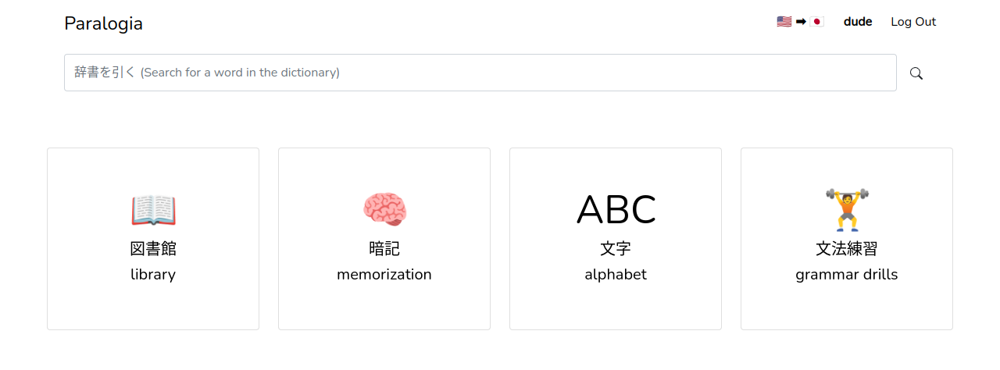
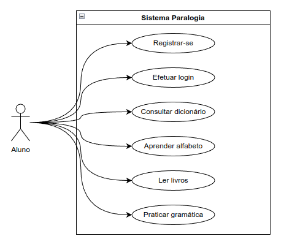

# Paralogia
## Introdução
No mundo globalizado em que vivemos, onde inúmeras línguas são faladas todos os dias, a busca por pessoas hábeis em  compreendê-las vem crescendo e muito.

Este projeto visa o desenvolvimento de um ambiente integrado 
de aprendizado linguístico, fornecendo ao usuário tudo o que 
precisa para aprofundar-se no seu idioma de escolha.

## Descrição da Arquitetura

Trata-se de uma aplicação web que usa a biblioteca Bootstrap para construção de sua interface, assim como Flask e SQLite para o gerenciamento do backend. 

## Features
- Dashboard
- Dicionário (com exemplos)
- Treino gramatical
- Aprendizado do alfabeto
- Memorizador de vocabulário
- Biblioteca
- Assistente de leitura

## Requisitos Funcionais
- Usuários podem buscar por palavras no dicionário
- Usuários podem inserir seus próprios textos para lê-los no reader mode
- Usuários podem trocar de senha
- Usuários podem deletar suas contas

## Requisitos Não-Funcionais
- A aplicação deve ser fácil de usar e intuitiva
- A aplicação deve ter uma aparência amigável	

## Histórias de Usuário
- Como usuário, quero poder aprender o alfabeto​
- Como usuário, quero poder buscar palavras no dicionário​
- Como usuário, quero poder ler livros com auxílio de um assistente​
- Como usuário, quero poder memorizar vocabulário importante​
- Como usuário, quero poder praticar minha gramática

## Diagrama de casos de uso

## Modelo do banco de dados (momentariamente)

## Requerimentos
- Python 3
- click
- Flask
- Flask_WTF
- jamdict
- pytest
- SudachiPy
- Werkzeug

## Instalação
1. Clona o repositório com `git clone https://github.com/epicdude78/paralogia`
2. Entre no diretório com `cd paralogia`
3. Crie um ambiente virtual com `virtualenv venv` e entre nele usando `source venv/bin/activate`
3. Instale os pacotes com `pip install -r requirements.txt`

## Executando
1. Antes de usar o app pela primeira vez será preciso inicializar seu banco de dados por meio do seguinte comando: `flask --app paralogia init-db`. Seu banco se encontrará na pasta `instances` .
2. Com o banco de dados pronto e uma vez entrado no seu ambiente virtual, basta executar o projeto em si: `flask --app paralogia run --debug`

## Contribuindo
1. Faça um fork do repositório
2. Faça um branch `git checkout -b <nome-branch>`
3. Altere o código
4. Faça um commit `git commit -am 'Implementei um adendo'`
5. Faça um push `git push origin <nome-branch>`
6. E finalmente, faça um pull request.
